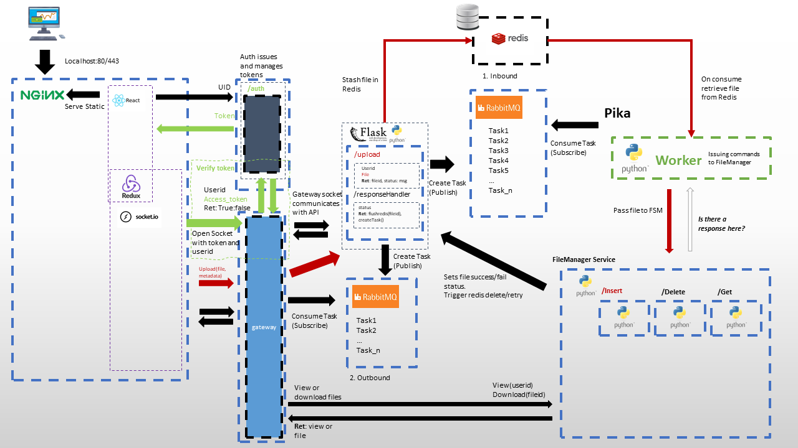

# 2020_group_12_s3993914_s4091221_s4199456

## Problem Statement
There is a requirement for a system which allows clients to connect to a pool on a hosted system to upload files and periodically receive async updates after some time. Multiple pools can be running simultaneously that require some Identity and Access Management. A client pool may consist of 2 to thousands of client applications. Each client application performs some task that produces a file that is required by a hosted server. Each client in the pool generates these files asynchronously (some clients may even be listeners and provide no updates) and sends them to our project system through an API for processing, there is a user defined update frequency from minutes to days required. Some clients may not be able to send updates immediately and will cache local updates until a batched update can be sent with multiple timestamps contained. 

The file size(s) being sent are 100’s of Kbs to 10’s of Mbs. Although sending updates asynchronously, it is required that batches from similar timestamps are grouped, this can be through the range on the timestamp, or otherwise. A server, external to this system, will request a group's files at a given trigger event. The external server will then perform some operation for roughly 2 minutes. On completion the external server will return to our project system a single file intended to be shared back down to the entire client pool. 

## Architecture Diagram

## Changelog
React App currently getting a JWT token generated from a static endpoint working only for 'test' user

https://zgadzaj.com/development/docker/docker-compose/containers/rabbitmq